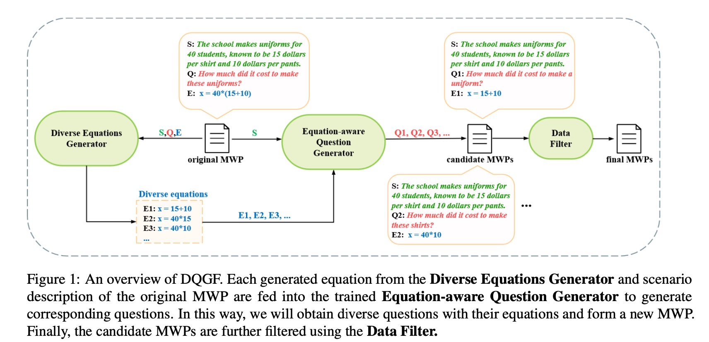

[Learning by Analogy: Diverse Questions Generation in Math Word Problem](https://aclanthology.org/2023.findings-acl.705/)
## Overview
<h1 align='center'>
  <br>
  
  <br>
</h1>

Diverse questions generation framework (DQGF) can automatically generate diverse questions with their corre- 141 sponding equations for a given MWP.


## Data
* DiverseMath23k: data/DiverseMath23k consists of our generated data on Math23k. Specifically, DiverseMath23k-train/dev/text.json is the dataset we reported in paper. Furthermore, we give the DiverseMath23k-original.json, which is a dataset generated by DQGF but not filtered. It has 28w diverse MWP data, you can use a strong filter (like ChatGPT) to get clean them.

* DiverseMath23k: data/Unbiased_DQGF consists of our generated data on Unbiased-source.

## Equations Generator
```bash
#process data
python turnNum2Sym.py
#generate equations
python get_generate.py
#process equation file to the format in Question Generator
python process.py
```

## Question Generater


## Filter
* In this paper, we use [MWP-bert](https://github.com/LZhenwen/MWP-BERT) as our filter.
 
## Citation
```bash
@inproceedings{zhou-etal-2023-learning-analogy,
    title = "Learning by Analogy: Diverse Questions Generation in Math Word Problem",
    author = "Zhou, Zihao  and
      Ning, Maizhen  and
      Wang, Qiufeng  and
      Yao, Jie  and
      Wang, Wei  and
      Huang, Xiaowei  and
      Huang, Kaizhu",
    booktitle = "Findings of the Association for Computational Linguistics: ACL 2023",
    year = "2023",
    pages = "11091--11104",
}
```